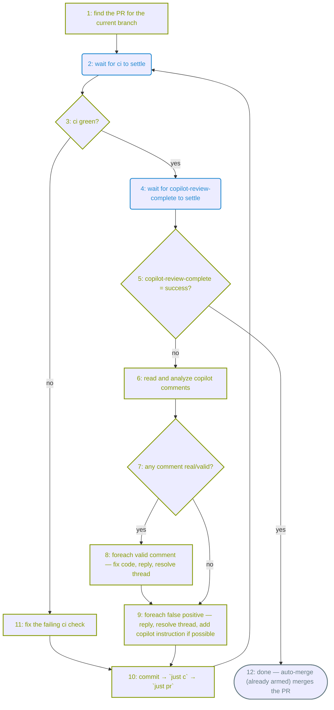

# resolve-pr-review-comments

Invoked as `/resolve-pr-review-comments [<pr-number-or-url>]`. With no argument it
targets the current branch's PR. Prompt-driven: drive `gh` directly and supply the
judgment yourself.

Scope: **GitHub Copilot inline review threads** (author login matches `copilot`
case-insensitively, `__typename` is `Bot`). The PR's top-level review *summary* is
not a resolvable thread — read it for context only.

## How merge is gated

Merging needs three things on the head: the `ci` check passing, a required
`copilot-review-complete` commit status of `success`, and every Copilot thread
resolved. The org gate (a reusable workflow) watches Copilot's review and posts
`copilot-review-complete`: `success` when no unresolved Copilot threads remain,
else `failure`. The native `copilot-pull-request-reviewer` check-run is **not**
the gate — it is excluded from the status rollup; key off `copilot-review-complete`
instead.

*The skill's own loop, step by step — waiting on CI/Copilot (rounded, blue), your
actions and decisions (green — square for actions, diamond for decisions), done
(stadium, grey); node numbers match the steps below:*



This skill drives that loop end to end: wait for `ci`, fixing it if it's red;
wait for the Copilot gate, triaging its comments if it's red; commit, run
`just pr`, and go around again — until both read green. Auto-merge is safe to
leave on throughout: nothing merges while either check is red or a Copilot
thread is unresolved, and every push resets both checks on the new head, so the
merge only ever fires once the watcher has just certified the current head
clean. Let `just pr` and the gates decide when, rather than hand-managing
auto-merge with `--hold`.

## Step 1 — find the PR

```bash
PR_ARG='__ARGUMENT_OR_EMPTY__'   # the slash-command argument, or empty
OWNER=$(gh repo view --json owner -q .owner.login)
REPO=$(gh repo view --json name -q .name)
NUMBER=$(gh pr view $PR_ARG --json number -q .number)
```

If `gh pr view` reports no PR for the current branch and no argument was given,
stop and ask the user for the PR number — do not guess.

## Steps 2–3 — wait for CI, then branch

Confirm CI is green before even looking at Copilot's review — no point triaging
comments against code that's about to fail its own tests:

```bash
for _ in $(seq 1 30); do
  BUCKET=$(gh pr checks "$NUMBER" --json name,bucket \
    -q '(.[] | select(.name=="ci") | .bucket) // "none"')
  case "$BUCKET" in pass|fail|skipping|cancel) break;; esac
  sleep 10
done
```

(`gh pr checks` is safe here — unlike for the Copilot gate below — because `ci`
always exists once the push triggers it; see Notes.)

- **`pass`** → continue to **Step 4**.
- **anything else** (`fail`, `skipping`, `cancel`) → **Step 11**: work out why
  and fix it. `gh pr checks "$NUMBER" --json name,link -q '.[]|select(.name=="ci")|.link'`
  opens the failing run; `just c` runs the same lint/type/test gate `ci` does
  and is usually the fastest way to reproduce and fix the break. Then go to
  **Step 10**.
- Loop exhausted with no terminal bucket → stop and tell the user; `ci` may be
  stuck queued or the runner may be down.

## Steps 4–5 — wait for the Copilot gate, then branch

Once `ci` is green, wait for the Copilot gate the same way — polling the commit
status directly rather than `gh pr checks` (see Notes for why):

```bash
SHA=$(git rev-parse HEAD)
for _ in $(seq 1 120); do
  STATE=$(gh api "repos/$OWNER/$REPO/commits/$SHA/statuses" \
    --jq 'map(select(.context=="copilot-review-complete"))[0].state // "none"')
  case "$STATE" in success|failure|error) break;; esac
  sleep 10
done
```

- `success` → **Step 12**, done.
- `failure` → **Step 6** to triage this round's comments. After 5 round trips
  through the loop with threads still remaining, stop, disable auto-merge
  (`gh pr merge "$NUMBER" --disable-auto`), and report what's left — this guards
  against endless Copilot ping-pong.
- `error` or loop exhausted → stop and tell the user (Copilot may be unavailable
  or out of quota, or the gate hit a machinery fault); don't spin forever.

## Steps 6–9 — triage every unresolved comment

Read the unresolved Copilot threads and the diff for the cited files, so your
decision is grounded in the real code (**Step 6**):

```bash
gh api graphql -F owner="$OWNER" -F name="$REPO" -F number="$NUMBER" -f query='
query($owner:String!,$name:String!,$number:Int!){
  repository(owner:$owner,name:$name){
    pullRequest(number:$number){
      reviewThreads(first:100){
        nodes{
          id isResolved isOutdated path line
          comments(first:50){ nodes{ databaseId body author{ login __typename } } }
        }
      }
    }
  }
}'
gh pr diff "$NUMBER"
```

Keep threads where `isResolved` is false and the first comment's author is Copilot;
record each thread's `id`, `path`, `line`, and comment `body`.

Treat every comment with skepticism first — false positives land on almost every
PR. Judge it against the real code, not its own framing: fact-check factual
claims (web search if the code alone doesn't settle it) and weigh it against this
repo's actual goals and conventions (`CLAUDE.md`) before agreeing to change
anything. Neither reflexively agree (Copilot is often right, not always) nor
reflexively defend the code. Act on real bugs, correctness or security risks,
clearer idiomatic forms, and genuine standards violations; disagree with false
positives, style contrary to the repo's conventions, or out-of-scope suggestions
(**Step 7**).

Reply on each thread (not a new top-level comment). Where you **agree**, edit the
code in the working tree — the better long-term design, not the smallest diff —
then reply that it's addressed (e.g. "Done — extracted the guard into
`ensure_loaded`.") (**Step 8**). Where you **disagree**, give the reason in a
sentence or two, referencing the code (**Step 9**). One fix may settle several
threads — note it on each. Then resolve every processed thread:

```bash
gh api graphql -f threadId='<thread-node-id>' -f body='<reply>' -f query='
mutation($threadId:ID!,$body:String!){
  addPullRequestReviewThreadReply(input:{pullRequestReviewThreadId:$threadId,body:$body}){ comment{ url } }
}'
gh api graphql -f threadId='<thread-node-id>' -f query='
mutation($threadId:ID!){ resolveReviewThread(input:{threadId:$threadId}){ thread{ isResolved } } }'
```

If a disagreement is a false positive from a *recurring class* of mistake (not a
one-off), add a short, abstract instruction to `.github/copilot-instructions.md`
to head it off in future reviews — abstract enough to cover the class, not just
this instance. Skip it if the mistake couldn't plausibly recur.

Once every thread is resolved, go to **Step 10**.

## Step 10 — commit, verify, and push

**Commit every code fix before moving on.** `just pr` below only pushes
*committed* work — an uncommitted fix is silently skipped, the head doesn't
change, and the moment threads resolve, the already-armed auto-merge fires on
that unchanged head, **merging the PR without your fix** while the thread reply
claims it landed. Run `just c` to verify, then `git add` and `git commit` the
touched files, and confirm before continuing:

```bash
git status --porcelain   # must be empty
git log --oneline -1     # must show your fix commit, not the pre-existing head
```

Then run `just pr`. It pushes the current head, flips back to ready, and enables
auto-merge (held by the gates until the head is clean).

- **Changed code** (fixed comments, or fixed a CI failure) → `just pr` flips the
  PR to draft, pushes the fixes, and flips back to ready; that transition
  re-triggers fresh `ci` and Copilot runs on the new commits.
- **No code change** (every thread was a disagreement) → nothing to push, so
  `just pr` just re-flips draft→ready to re-run the watcher and re-count the
  now-resolved threads. It permits this only because Copilot already reviewed
  HEAD; it still refuses if you pre-pushed unreviewed commits.

An unexpected `Everything up-to-date` means an uncommitted fix, not a pushed
one — commit and re-run. Then go back to **Step 2**.

## Step 12 — confirm and report

Reached when `copilot-review-complete` is `success`, with `ci` already green
from Step 3. Every `--ready` run of `just pr` already polls the merge state and
either merges directly or arms auto-merge (`push-branch.ts`) — there's nothing
left to trigger. Just read the outcome:

```bash
gh pr view "$NUMBER" --json state,mergedAt,autoMergeRequest
```

Report whether it merged already or is still queued behind auto-merge. Summarize
per round: agreed-and-fixed (with file:line and what changed) vs. disagreed (with
the reason given), and the final outcome.

## Notes

- The reply, resolve, ready-flip, and merge calls need a token with write access
  (the user's normal `gh auth`). On a permissions error, surface it and stop —
  don't retry blindly.
- Past 100 threads or 50 comments in a thread, paginate with the GraphQL
  `pageInfo`/`endCursor` cursors rather than silently truncating.
- Each push is a fresh head with neither check posted yet, so merge can only
  happen once `ci` and the gate both read clean on the latest head with every
  thread resolved — the loop relies on this, it doesn't race it.
- `gh pr checks --watch` looks like a shortcut for the wait loops above — it
  isn't safe for the Copilot gate: it only reports checks that already exist,
  so a required status not yet posted (a fresh head's `copilot-review-complete`)
  is invisible to it and it returns success early. Confirmed live: a PR with
  `mergeStateStatus: BLOCKED` still showed `--watch --required` reporting all
  visible required checks passing. Poll the status list yourself instead —
  that's why Steps 4–5 use the raw API rather than `gh pr checks`.
