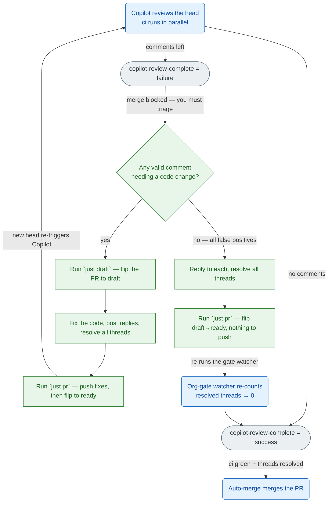

# resolve-pr-review-comments

Invoked as `/resolve-pr-review-comments [<pr-number-or-url>]`. With no argument it
targets the current branch's PR. Prompt-driven: drive `gh` directly and supply the
judgment yourself.

Scope: **GitHub Copilot inline review threads** (author login matches `copilot`
case-insensitively, `__typename` is `Bot`). The PR's top-level review *summary* is
not a resolvable thread — read it for context only.

## How merge is gated

The org gate (a reusable workflow) watches Copilot's review and posts a required
`copilot-review-complete` commit status on each head: `success` when no unresolved
Copilot threads remain, else `failure`. Merging needs that status `success`, `ci`
green, and every thread resolved. The native `copilot-pull-request-reviewer`
check-run is **not** the gate — it is excluded from the status rollup; key off
`copilot-review-complete` instead.

*Who does what to clear the gate — automatic steps (rounded, blue), your actions (square, green), gate status (pill, grey), decisions (diamond); edge labels are the condition or effect:*



This skill walks that flow: resolve the current Copilot threads, run `just pr` to
refresh the gate, wait for its verdict, repeat until `copilot-review-complete` is
`success`. Auto-merge is safe to leave on throughout: while any Copilot thread is
unresolved the status is `failure`, so nothing merges in the gap between resolving
threads and the `just pr` that refreshes the gate — the merge only ever fires on a
head the watcher has just certified clean. Let `just pr` and the gate decide when,
rather than hand-managing auto-merge with `--hold`.

## Step 1 — identify the PR

```bash
PR_ARG='__ARGUMENT_OR_EMPTY__'   # the slash-command argument, or empty
OWNER=$(gh repo view --json owner -q .owner.login)
REPO=$(gh repo view --json name -q .name)
NUMBER=$(gh pr view $PR_ARG --json number -q .number)
```

If `gh pr view` reports no PR for the current branch and no argument was given,
stop and ask the user for the PR number — do not guess.

## Step 2 — check the gate, then read the threads

Read `copilot-review-complete` on the head; if it is already `success`, skip to
Step 5.

```bash
SHA=$(git rev-parse HEAD)
gh api "repos/$OWNER/$REPO/commits/$SHA/statuses" \
  --jq 'map(select(.context=="copilot-review-complete"))[0].state // "none"'
```

Otherwise read the unresolved Copilot threads and the diff for the cited files, so
your decision is grounded in the real code:

```bash
gh api graphql -F owner="$OWNER" -F name="$REPO" -F number="$NUMBER" -f query='
query($owner:String!,$name:String!,$number:Int!){
  repository(owner:$owner,name:$name){
    pullRequest(number:$number){
      reviewThreads(first:100){
        nodes{
          id isResolved isOutdated path line
          comments(first:50){ nodes{ databaseId body author{ login __typename } } }
        }
      }
    }
  }
}'
gh pr diff "$NUMBER"
```

Keep threads where `isResolved` is false and the first comment's author is Copilot;
record each thread's `id`, `path`, `line`, and comment `body`.

## Step 3 — decide, reply, fix, and resolve every thread

Judge each comment on its merits against the real code — neither reflexively agree
(Copilot is often right, not always) nor reflexively defend the code. Honor the
repo's `CLAUDE.md`: idiomatic solutions, self-documenting names, fix-don't-silence.
Act on real bugs, correctness or security risks, clearer idiomatic forms, and
genuine standards violations; disagree with false positives, style contrary to the
repo's conventions, or out-of-scope suggestions.

**If your triage concludes at least one comment is valid and needs a code change,
flip the PR to draft with `just draft` *before* you edit any code or resolve any
thread.** Drafting up front means every fix lands while the PR is already a draft,
so the later `just pr` only has to push and flip back to ready — and that single
ready transition is what reliably re-triggers Copilot on the new commits. Flipping
inside `just pr` (draft→push→ready in one shot) has proven racy; pre-drafting here
removes the race. Skip `just draft` only when every comment is a false positive and
no code will change — there `just pr` handles the refresh flip itself.

Reply on each thread (not a new top-level comment). Where you **agree**, edit the
code in the working tree (the better long-term design, not the smallest diff), then
reply that it's addressed (e.g. "Done — extracted the guard into `ensure_loaded`.").
Where you **disagree**, give the reason in a sentence or two, referencing the code.
One fix may settle several threads — note it on each. Then resolve every processed
thread.

```bash
gh api graphql -f threadId='<thread-node-id>' -f body='<reply>' -f query='
mutation($threadId:ID!,$body:String!){
  addPullRequestReviewThreadReply(input:{pullRequestReviewThreadId:$threadId,body:$body}){ comment{ url } }
}'
gh api graphql -f threadId='<thread-node-id>' -f query='
mutation($threadId:ID!){ resolveReviewThread(input:{threadId:$threadId}){ thread{ isResolved } } }'
```

## Step 4 — refresh the gate and wait for its verdict

Run `just pr`. It pushes the current head, flips back to ready, and enables
auto-merge (which the gate holds until the head is clean):

- **Changed code** (you fixed valid comments) → you already drafted the PR in Step 3,
  so `just pr` simply pushes the fixes onto the draft and flips to ready; that ready
  transition re-triggers a fresh Copilot review of the new commits.
- **No code change** (every thread was a disagreement) → you skipped `just draft`, so
  the PR is still ready; `just pr` does its own draft→ready flip to re-run the watcher
  and re-count the now-resolved threads. It permits this only because Copilot already
  reviewed HEAD; it still refuses if you pre-pushed unreviewed commits.

Then wait for `copilot-review-complete` on the current head to settle:

```bash
SHA=$(git rev-parse HEAD)
for _ in $(seq 1 120); do
  STATE=$(gh api "repos/$OWNER/$REPO/commits/$SHA/statuses" \
    --jq 'map(select(.context=="copilot-review-complete"))[0].state // "none"')
  case "$STATE" in success|failure|error) break;; esac
  sleep 10
done
```

- `success` → go to Step 5.
- `failure` → return to **Step 2** for the next round. After **5 rounds** with
  threads still remaining, stop, disable auto-merge (`gh pr merge "$NUMBER"
  --disable-auto`), and report what's left — this guards against endless Copilot
  ping-pong.
- `error` or timeout → stop and tell the user (Copilot may be unavailable or out of
  quota, or the gate hit a machinery fault); don't spin forever.

## Step 5 — confirm the merge and report

Reached when `copilot-review-complete` is `success`. The clean head satisfies every
required check, so ensure auto-merge is enabled and let it merge — a `just pr` from
Step 4 may have already enabled it (or the PR may have merged already), so this is
idempotent:

```bash
gh pr merge "$NUMBER" --squash --auto --delete-branch 2>/dev/null || true
```

Read the PR state to see whether it merged or is queued, and report. Summarize per
round: agreed-and-fixed (with file:line and what changed) vs. disagreed (with the
reason given), and the final outcome.

## Notes

- The reply, resolve, ready-flip, and merge calls need a token with write access
  (the user's normal `gh auth`). On a permissions error, surface it and stop — don't
  retry blindly.
- Past 100 threads or 50 comments in a thread, paginate with the GraphQL
  `pageInfo`/`endCursor` cursors rather than silently truncating.
- Each push is a fresh head with no `copilot-review-complete` yet, so merge can only
  happen once the gate re-posts `success` on the latest head with all threads
  resolved — the loop relies on this, it doesn't race it.
