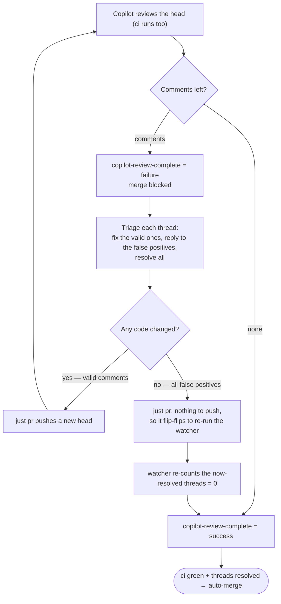

# PR Gate Perfect World

## Invariant Rules

### human approvals

- not required except for files marked with CODEOWNERS

### ci

- auto-run on every push to the PR branch
- is a mandatory check for merge into main

### copilot_code_review

- only run on "ready" PRs
- auto-run on every push to the PR branch
- is a mandatory check for merge into main

### review comments

- must be resolved prior to merge into main

### auto-merge

Should trigger when since the latest push to the PR branch:
- ci passed
- copilot_code_review has completed
- no unresolved copilot_code_review comments remain

New pushes invalidate both ci and copilot_code_review.

### skill

- the `/resolve-pr-review-comments` skill runs in a loop: read each unresolved Copilot thread, fix the valid ones and reply to the false positives, resolve all threads, `just pr` to refresh the gate — repeat until `copilot-review-complete` is `success`.

## Observations

- adding @Copilot as a reviewer via an action does not start copilot_code_review — only the ready-after-push flow (below) does
- copilot_code_review auto-starts on `ready_for_review` **only if a push landed between the draft and ready flips** (flip → push → flip): the ready flip must see a commit GitHub registered _before_ it. Flip → flip (no push) and flip → flip → push (push after the ready flip, arriving as a `synchronize` on an already-ready PR) request nothing. Also requires the branch policy's automatic copilot_code_review setting.
- Copilot reviews are comment-only: they never count as approvals and never block merge natively (per GitHub docs)
- the native `copilot-pull-request-reviewer` check-run shows up in the REST `commits/{sha}/check-runs` API but is excluded from the PR status rollup, so it can never satisfy a required status check — it stays "Expected" forever and blocks the PR
- the Copilot check-run and review are produced by the `github-actions` app using `GITHUB_TOKEN`; GitHub never starts a workflow from an event triggered by `GITHUB_TOKEN` (recursion prevention), so the watcher cannot be driven by Copilot's `check_run` (or `pull_request_review`) completion — those events fire no workflow at all
- Copilot marks its check-run `completed` (conclusion `success`) 1–2s _before_ it submits the review and its comments, and the conclusion is `success` even when comments follow — so the watcher waits for the review submission and counts unresolved threads before recording `success`, or auto-merge could fire in the gap before `required_review_thread_resolution` sees the comments
- `GITHUB_TOKEN` cannot flip a PR's draft state: REST has no field for it, and the GraphQL `convertPullRequestToDraft` mutation rejects the Actions integration token with `Resource not accessible by integration` even when granted `pull-requests: write` — so the watcher cannot auto-draft a PR on unresolved comments; the `failure` status alone blocks the merge, and `just pr` re-arms Copilot on the next push

## Implementation

The invariants map onto enforceable GitHub mechanisms as follows:

- `ci` mandatory — required status check (`ci`), `strict_required_status_checks_policy` ties it to the latest push.
- `copilot_code_review` mandatory — cannot be required natively (see Observations). The org reusable workflow [`org_gate_base`](https://github.com/zyplux/.github/blob/main/apps/copilot-review-gate/README.md), called by this repo's thin `.github/workflows/org_gate.yml`, triggers on `pull_request`, waits for Copilot's review to be submitted (not just its check-run — see Observations), counts unresolved Copilot comment threads, and records a rollup-visible `copilot-review-complete` status the ruleset requires: `success` when none remain, else `failure` (which blocks the merge). Each push is a fresh SHA with no status yet, so the gate is unsatisfied until the watcher re-posts — that's the per-push invalidation.
- no unresolved review comments — `required_review_thread_resolution`.
- human approvals only for CODEOWNERS files — `require_code_owner_review`, `required_approving_review_count: 0`, `require_last_push_approval: false`.

## Operating

A Copilot review resolves one of three ways, all driven by `just pr`:

Re-triggering Copilot requires the push to land _inside_ the draft→ready cycle, in that order: `cz push-branch --ready` (`just pr`) flips to draft, pushes, then flips to ready — and the ready flip, seeing the just-pushed commit, requests the review.

When there is nothing to push, `just pr` splits on whether Copilot already reviewed `HEAD`. If it did (you resolved its comments with no code change), the flip → flip re-runs the watcher to re-count the now-resolved threads — no new Copilot review, just a fresh gate verdict that unblocks the merge. If it did not (you pre-pushed unreviewed commits), `just pr` errors, because a flip → flip there would re-trigger nothing useful.

Never flip draft/ready by hand: a manual flip → flip, or a push that lands after the ready flip, requests no review and strands the PR. Always use `just pr`.

The watcher runs from the human `pull_request` event and polls the check-runs API — **not** from Copilot's completion, since the Copilot check-run/review come from `GITHUB_TOKEN`, whose events start no workflow. Full rationale (draft→ready race, live-draft polling, pagination filter, concurrency key) lives with the [reusable workflow](https://github.com/zyplux/.github/blob/main/apps/copilot-review-gate/README.md).
