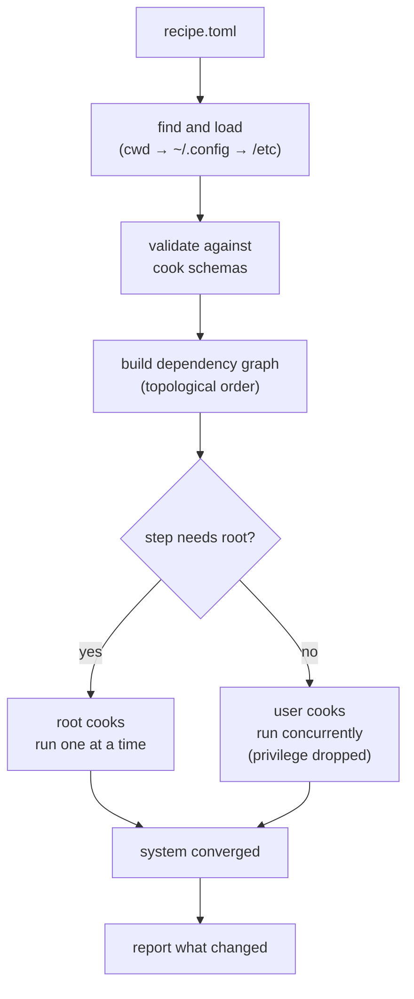

# 🧑‍🍳 totchef

**Write down how your machine should be set up. Run one command. It complies.**

`totchef` is a declarative, idempotent system configurator for Ubuntu/Kubuntu. You
write a `recipe.toml` — apt repos and packages, vendor CLIs, files in `/etc`,
shell setup, per-app tweaks — and `totchef` makes the system match it. Run it on a
fresh laptop to bootstrap; run it again next week to top up. It only touches what
has actually drifted, so re-runs are cheap and safe.

> Your tiny line cook: hand it a recipe and it works the whole kitchen — apt
> packages, vendor CLIs, `/etc`, per-app tweaks — plating only what isn't already
> done. *"Yes, chef!"*

```console
totchef up
```

---

## Install

`totchef` is distributed as a [uv](https://docs.astral.sh/uv/) tool. If you don't
have `uv` yet:

```sh
curl -LsSf https://astral.sh/uv/install.sh | sh
```

Then install (and later upgrade) `totchef`:

```sh
uv tool install totchef
uv tool upgrade totchef
```

This drops a `totchef` command on your `PATH` in its own isolated environment — no
Python setup, nothing to pollute your system.

---

## 60-second quickstart

1. Write a `recipe.toml` in your current directory:

   ```toml
   [apt_pkg]
   packages = ["ripgrep", "fd-find", "btop"]

   [url.uv]
   url = "https://astral.sh/uv/install.sh"
   update_action = ["self", "update"]
   ```

2. Preview what would change — no root, no writes:

   ```sh
   totchef plan
   ```

3. Apply it (escalates to root only for the steps that need it):

   ```sh
   totchef up
   ```

Run `totchef up` again any time. Already-satisfied steps report `up-to-date` and
are skipped.

---

## How an `up` run works

*What happens when you run `totchef up`?*



You launch `totchef` as yourself. It escalates to root only when a step needs it,
and drops back to your user for everything else — so a vendor installer that wants
your `$HOME` runs as you, while an apt transaction runs as root.

---

## Writing a recipe

A recipe is a TOML file. Each **section** is handled by a **cook** — a small
manager for one domain. The section name picks the cook: `[apt_pkg]` is cooked by
the apt-package cook, `[url.uv]` by the URL-installer cook.

There are two section shapes:

- **Plain sections** — one block of data, one unit of work. `[apt_pkg]` with a
  `packages = [...]` list is a single step.
- **Subtable sections** — `[url.uv]`, `[url.rustup]`, `[file.nvidia_power]` — each
  named entry is its own step, scheduled independently.

### Two reserved fields

Any entry may carry two fields that `totchef` reads and then strips before the cook
sees the rest:

| Field | Meaning |
|---|---|
| `needs_root` | `true` runs this step as root; otherwise it runs as you. Grant it on the **leaf entry** that needs it, never on a subtable header — that would hand root to every entry under it. Most cooks default sensibly (apt/snap are root, vendor installers are not). |
| `depends_on` | A list of steps that must finish first. Name an entry (`"url.rustup"`), a single-step section (`"apt_pkg"`), or a whole section (`"apt_repo"`, which waits on all its entries). `totchef` topologically sorts the result; a cycle is a lint error. |

Any entry may also carry a `pre_hook` (a guard: a non-zero exit **skips** the step)
and a `post_hook` (a shell command run **only when the step changed something**) —
on a versioned section like `[bun]` these gate and follow the whole sync, on a
per-resource section like `[file.<name>]` they gate and follow each resource.

### Section defaults

In a subtable section, keys set on the header are inherited by every entry: lists
**union** (the entry extends the shared list), scalars are **overridden** by the
entry. Handy for sharing a common `depends_on` or a base feature list:

```toml
[desktop]
depends_on = ["apt_pkg"]
features = ["VaapiOnNvidiaGPUs", "WaylandLinuxDrmSyncobj"]

[desktop.brave]
desktop = "/usr/share/applications/brave-browser.desktop"
features = ["AcceleratedVideoEncoder"]   # → unions onto the two above
```

### Validate before you run

```sh
totchef lint
```

Every entry is checked against its cook's schema (unknown keys are an error, not a
silent typo), the dependency graph is checked for cycles, and `needs_root`
placement is verified. `totchef plan` does all of that and then shows you the diff.

---

## Built-in cooks

Run `totchef cooks` to see what's available on your machine. The ones that ship in
the box:

| Section | Cooks | Key fields |
|---|---|---|
| `[url.<name>]` | vendor `curl \| bash` installers | `url`, `bin`, `args`, `update_action`, `update_guard` |
| `[cargo]` | Rust crates via `cargo-binstall` | `packages` |
| `[uv]` | Python CLI tools in isolated venvs | `packages` |
| `[bun]` | global npm packages via `bun add -g` | `packages` |
| `[file.<name>]` | install a file with exact content | `path`, `source` or `content`, `mode`, `pre_hook`, `post_hook` |
| `[bash.<name>]` | idempotent shell snippets | `current_state`, `desired_state`, `apply`, `pre_hook`, `post_hook` |
| `[apt_repo.<name>]` | third-party apt repos + keys (root) | `key_url`, `uris`, `suites`, `components`, `architectures` |
| `[apt_pkg]` | apt packages via `nala` (root) | `packages` |
| `[snap]` | snap packages (root) | `packages` |
| `[desktop.<app>]` | `.desktop` `Exec=` overrides | `desktop`, `features`, `switches` |
| `[chromium_flags.<app>]` | Chromium Local State / Electron `argv.json` | `local_state`, `argv_json`, `features` |
| `[settings.<app>]` | merge an env block into a JSON file | `settings_json`, `settings_env` |

A full, real-world recipe — a hybrid-GPU laptop with an eGPU, NVIDIA drivers, and
browser tuning — lives in [`examples/recipe.toml`](examples/recipe.toml).

---

## Where `totchef` looks for the recipe

In precedence order:

1. `--recipe PATH` (or `-r PATH`)
2. `$TOTCHEF_RECIPE`
3. `recipe.toml` in the current directory, then walking up to `/` (project-local)
4. `~/.config/totchef/recipe.toml` (per-user)
5. `/etc/totchef/recipe.toml` (system-wide)

`totchef where` prints the path it would use, so you're never guessing.

---

## Writing your own cook

`totchef` ships its built-in cooks through an entry-point group — and your cooks
join the same way. Two routes, depending on how much ceremony you want.

### A packaged plugin (shareable, versioned)

Subclass a cook base in your own package and register the section it serves:

```python
# my_totchef_plugins/foo_cook.py
from totchef.cook_base import PackageListCook

class FooCook(PackageListCook):
    ...
```

```toml
# your package's pyproject.toml
[project.entry-points."totchef.cooks"]
foo = "my_totchef_plugins.foo_cook:FooCook"
```

Install it alongside `totchef` and `[foo]` becomes a usable section:

```sh
uv tool install totchef --with my-totchef-plugins
```

### A local cook (no packaging, instant)

Drop a `<section>_cook.py` into `~/.config/totchef/cooks/`. It must define exactly
one `CookBase` subclass; the filename (minus a `_cook`/`_root_cook` suffix) is the
section it serves. A local cook **shadows** a built-in of the same name — handy for
prototyping or overriding behaviour on one machine.

### The two cook shapes

- **`VersionedCook`** — for things with versions (packages). You implement
  `list_requested` / `list_installed` / `find_latest` / `sync`.
- **`StateCook`** — for desired-state resources (files, settings). You implement
  `get_current_state` / `get_desired_state` / `apply_resource`. `FileStateCook`
  diffs by content hash for you.

Cooks only *probe* and *act* — they hold no diff logic. `totchef` owns every
decision about what changed and what to run.

---

## Commands

| Command | What it does |
|---|---|
| `totchef up` | Apply the recipe; converge the system to it (escalates to root). |
| `totchef plan` | Dry-run: probe and print what would change. No root, no writes. |
| `totchef lint` | Validate the recipe against the cook schemas and exit. |
| `totchef cooks` | List every available cook and the section it serves. |
| `totchef where` | Print the recipe path that would be used. |
| `totchef --version` | Print the version. |

All recipe commands accept `--recipe/-r PATH`.

Set `TOTCHEF_INLINE=1` to run every cook in the foreground — no fork, no `sudo` — with logs streamed straight to the terminal. Use it to debug a cook or to apply under an existing root shell.

---

## One thing to know: convergence is create/update only

`totchef` drives resources toward their desired *presence* — it never prunes.
Removing an entry from your recipe (or uninstalling its target) leaves prior
artifacts in place: a written `/etc` drop-in, a repo's keyring, a `.desktop`
override. Teardown is deliberate and manual, so a typo can't wipe your system.

---

## Development

Tooling is `uv` (Python ≥ 3.14) driven through `just`:

| Command | What it does |
|---|---|
| `just plan` | Dry-run the example recipe. |
| `just up` | Apply the example recipe. |
| `just lint` | `ruff` + `rumdl` + dead-code + recipe lint. |
| `just tc` | Lint, then `pyright`. |
| `just test` | Typecheck, then `pytest`. |

License: MIT.
