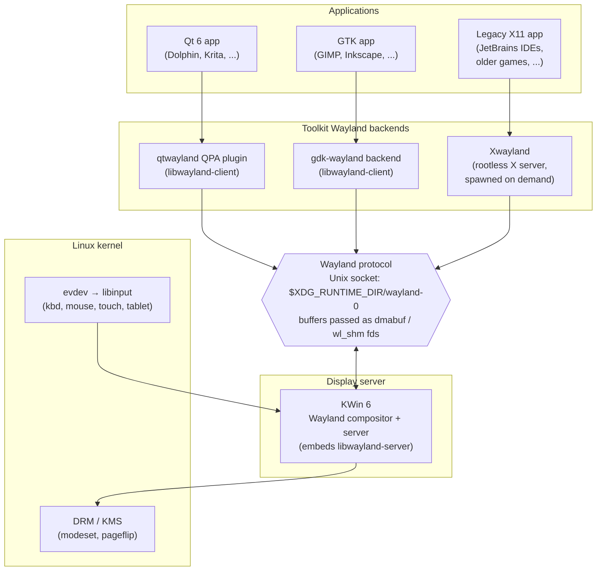
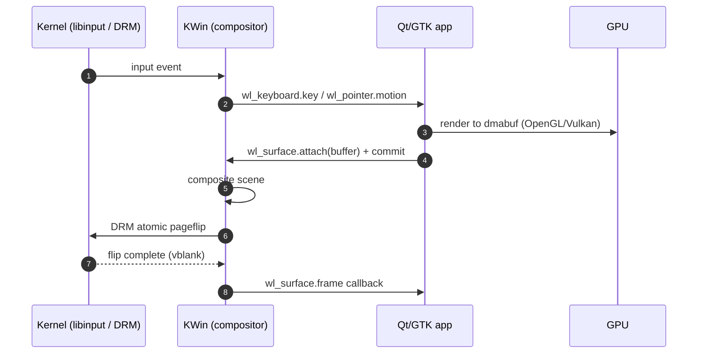
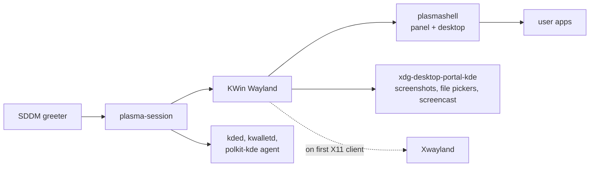

# Plasma on Wayland — Architecture Overview (Kubuntu 26.04)

## The big picture



## Key terms

- **DRM / KMS** — Direct Rendering Manager and Kernel Mode-Setting, the kernel subsystem that owns the GPU. KMS programs CRTCs, connectors, and planes (the per-display scanout engines); DRM exposes command submission and buffer allocation.
- **dma-buf** — kernel-allocated GPU buffer exported as a file descriptor so it can be shared between processes (and between CPU, GPU, and scanout hardware) without copies.
- **EGL / GBM** — EGL is the GL/Vulkan ↔ window-system glue; GBM (Generic Buffer Manager) lets a Wayland compositor allocate dma-buf-backed buffers directly through DRM.
- **logind** — `systemd-logind`, the D-Bus service that tracks login sessions, seats, and VTs, and brokers access to seat-controlled devices (DRM, input) so the compositor never needs to run as root.
- **PipeWire** — userspace multimedia server that handles audio *and* screen capture; the `xdg-desktop-portal` screencast API hands compositor-captured frames to clients as PipeWire streams.

## What each piece is

### Wayland protocol

Is an object-oriented, asynchronous wire protocol that runs over a single Unix-domain socket (by default `$XDG_RUNTIME_DIR/wayland-0`) between exactly one server — the compositor — and many clients. Each message is a 32-bit target object ID followed by a single 32-bit word packing the total message length (upper 16 bits) and opcode (lower 16 bits), with inline arguments padded to 32-bit alignment. Requests flow client→server and events flow server→client; the wire is fully pipelined — `wl_display.sync` is the only explicit barrier, and even that returns asynchronously via a one-shot callback. Clients discover available functionality by binding globals advertised on the `wl_registry`, ranging from core interfaces like `wl_compositor`, `wl_surface`, and `wl_seat` to extensions such as `xdg-shell` for window management and `linux-dmabuf` for GPU buffer sharing.

Pixel data never travels through the socket itself. Clients render into off-socket buffers — either shared-memory pools attached via `wl_shm` for software rendering, or, more commonly, GPU buffers exported as `dma-buf` handles — and pass the underlying file descriptors to the compositor as `SCM_RIGHTS` ancillary data on that same Unix socket. The compositor then references those buffers by handle, so when a surface is committed it can either composite the buffer through its own GL/Vulkan pipeline or, when the pixel format, DRM modifier, and overlay-plane constraints all align, hand it directly to KMS for scanout, achieving zero copies end-to-end. Attached damage regions let the compositor repaint only what changed, and `wl_surface.frame` callbacks pace clients to the display's actual refresh rather than a free-running render loop, keeping latency bounded and avoiding wasted GPU work.

A consequence worth naming explicitly: because every client only sees its own surfaces and nothing about siblings, *the Wayland protocol has no notion of "read the pixels of another window" or "send a synthetic keystroke to another window."* Screenshots, screen recording, and assistive input emulation all have to go through the compositor as a trusted intermediary — historically via KDE-specific protocols, today via `xdg-desktop-portal` for capture and `libei` for input emulation. The security model is therefore the default rather than an opt-in add-on, which is the single biggest reason migration off X11 takes the shape it does.

### KWin

Plays three roles simultaneously in a Plasma Wayland session, all collapsed into a single process by Wayland's design:

- **Display server.** It terminates the Wayland protocol — it *is* the server.
- **Window manager.** It runs the window-management policy that decides how surfaces are stacked, focused, tiled, and decorated.
- **GPU compositor.** It drives the rendering pipeline that paints those surfaces onto the screen.

Downward, KWin opens DRM/KMS devices through `systemd-logind`: logind owns the seat, and its `TakeDevice` D-Bus method hands back an open file descriptor with the right capabilities so KWin becomes DRM master without being setuid root. The same mechanism revokes the fd across VT switches so an inactive session can't drive the display. Input arrives from `libinput` (keyboard, pointer, touch, tablet, switches) and is run through KWin's own xkbcommon keymap and acceleration curves before delivery.

Upward, it exposes core Wayland plus a layered set of freedesktop and KDE-specific protocols — `xdg-shell` for ordinary toplevels and popups, `wlr-layer-shell` for panels, notifications, and lockscreens, `linux-dmabuf` for zero-copy buffer import, plus `idle-inhibit`, `primary-selection`, output management, fractional scaling, and KDE's own `plasma-shell` and `plasma-window-management` — that clients bind through the registry.

The internal pipeline mirrors the buffer story above: a client's `dma-buf` is imported as an `EGLImage`, sampled in an OpenGL ES (or, on the newer Vulkan backend) shader, the result is rendered into a framebuffer, and KWin issues an atomic KMS commit to page-flip it onto the connector — unless the surface's format, modifier, and damage qualify it for direct scanout on an overlay or cursor plane, in which case the GPU composite step is skipped entirely.

### XWayland

Legacy X11 clients are not abandoned. The first time something tries to talk X11 — usually because a launched program reads `$DISPLAY` — KWin spawns a **rootless `Xwayland` server**. "Rootless" because it does not own the root window: every X11 toplevel is reflected one-for-one into a Wayland `wl_surface`, and the X11 server treats KWin's compositing as the screen. KWin additionally acts as the X11 window manager (ICCCM/EWMH) for those windows, so they participate in the same focus, stacking, and input-routing policy as native Wayland surfaces.

The seams that remain — global hotkeys, screen-coordinate clipboard sniffing, synthetic input injection — are exactly the places where the X11 security-by-omission model can't be retrofitted onto Wayland's deny-by-default. That is why some legacy tools (KeePassXC auto-type, Barrier/Synergy, `xdotool`-based scripts) need explicit accommodation — usually by routing through `xdg-desktop-portal` or `libei` rather than driving the X server directly. Xwayland is also where HiDPI integer-only scaling becomes most visible: X11 has no per-monitor scale, so KWin upscales the whole Xwayland output rather than letting individual X11 apps participate in `wp-fractional-scale-v1`.

### Qt 6 client

Loads the `wayland` QPA plugin from the qtwayland module — picked either by `XDG_SESSION_TYPE=wayland`/`WAYLAND_DISPLAY` autodetection or by an explicit `QT_QPA_PLATFORM=wayland` — and from that point on every `QWindow`, `QInputEvent`, and clipboard operation is translated into Wayland traffic. The plugin walks the `wl_registry` and binds the upstream protocols it knows: `xdg-shell` for toplevels and popups (each `QWindow` becomes a `wl_surface` plus an `xdg_surface` and either an `xdg_toplevel` or `xdg_popup`), `xdg-decoration` to negotiate who paints window chrome, `wp-fractional-scale-v1` together with `wp-viewporter` so the compositor can advertise a non-integer per-surface scale that Qt feeds into its scenegraph and `devicePixelRatio`, `linux-dmabuf-v1` to import the GPU buffers that `QtQuick` or `QOpenGLWindow` renders into, `wp-presentation-time` for accurate vsync timestamps and predicted refresh, `xdg-activation-v1` for focus-stealing-safe raising, and the input protocols (`text-input-v3`, `tablet-v2`, `pointer-constraints`, `relative-pointer`) for IME, tablet, and pointer-locked workloads. On top of those, Qt binds KDE-specific extensions — the older `org_kde_kwin_server_decoration` (which predates `xdg-decoration` and is still advertised by KWin for compatibility), `plasma-window-management` for taskbar integration and minimize/maximize from the panel, and a handful of smaller `org_kde_*` protocols — so a Plasma-hosted Qt app integrates more tightly than a generic Wayland client could.

Because both decoration protocols advertise *server_side* as the preferred mode under KWin, decorations end up server-side by default: KWin draws the titlebar and border around the client's content surface, and handles drag, resize, double-click-to-maximise, and the close/minimise/maximise buttons itself, so the client never receives those interactions as Wayland input events at all. Moved to a compositor that exposes neither protocol, or one that only supports the `client_side` mode (such as GNOME's Mutter), the same Qt plugin transparently falls back to drawing its own chrome.

### GTK client

Uses the `gdk-wayland` backend (selected by `GDK_BACKEND=wayland` or autodetection) and binds essentially the same upstream protocols Qt does — `xdg-shell`, `linux-dmabuf-v1`, `wp-fractional-scale-v1`, `wp-viewporter`, `wp-presentation-time`, `xdg-activation-v1`, `text-input-v3`, `tablet-v2`, `pointer-constraints`, `xdg-foreign-v2` (used by xdg-desktop-portal to pass window handles across process boundaries for file pickers and screenshots), `idle-inhibit`, and `primary-selection`. It ignores all `org_kde_*` extensions by design, so a GTK app under Plasma never participates in `plasma-window-management`; it stays a generic Wayland citizen, and KWin has to fall back to the `xdg-shell` title and app-id to slot it into the taskbar. For decorations, GTK either declines to bind `xdg-decoration` or binds it and immediately requests `client_side`, then paints the whole window frame itself: a `GtkHeaderBar` (usually merged with the app's toolbar into a single headerbar widget) serves as titlebar, while the resize border and drop shadow are rendered as part of the same `wl_surface`. Because that shadow extends past the visually-perceived window, GTK uses `xdg_surface.set_window_geometry` to tell KWin which sub-rectangle of the buffer is the "real" window for snapping, tiling, and screen-edge placement, and falls back to `xdg_toplevel.move`/`.resize` requests when the user grabs a decoration edge so that the compositor still runs the move/resize loop. KWin honours the CSD request and renders no frame, titlebar, or shadow of its own — it only enforces window-management policy against the advertised geometry. Setting `GTK_CSD=0` flips this default and asks for SSD via `xdg-decoration`, which KWin will happily provide, but headerbar-style apps then end up with two competing rows of window controls.

### Plasma 6 Wayland session

The "session" is the orchestrated userspace stack sitting on top of the kernel's DRM/KMS, evdev, and `systemd-logind` plumbing. It comes up in three phases.

**1. Login and environment.** SDDM authenticates the user via PAM, asks `systemd-logind` to allocate a session (claiming the VT and seat ownership), and execs `startplasma-wayland`. That wrapper exports `XDG_SESSION_TYPE=wayland`, `XDG_CURRENT_DESKTOP=KDE`, and the per-user D-Bus address, then hands off to the systemd user instance.

**2. Compositor bring-up.** The session is no longer a monolithic shell script but a graph of `systemd --user` units — `graphical-session.target`, `plasma-workspace.target`, `plasma-kwin_wayland.service`, `plasma-plasmashell.service`, and friends — wired together with strict `After=`/`Requires=` ordering, so "plasma-session" is really a synonym for "whatever the dependency graph happens to start next." KWin is the first thing on that graph. It opens DRM through logind's `TakeDevice` D-Bus method (no setuid root needed), configures outputs, creates the Wayland socket at `$XDG_RUNTIME_DIR/wayland-0`, and only then publishes `WAYLAND_DISPLAY` back into the systemd environment so dependent units can unblock. Nothing else can render before KWin exists, because nothing else has anywhere to connect — the socket simply does not exist yet, and a client calling `wl_display_connect()` would just get `NULL` with `errno=ENOENT`.

**3. Shell and services.** Once the socket appears, `plasmashell` connects, uses `wlr-layer-shell` to anchor panels, the desktop background, and the lockscreen surface to screen edges, and binds `plasma-window-management` so the taskbar can observe other clients. Background services follow — `kded6`, `kactivitymanagerd`, `kglobalaccel`, `baloo_file`, `xdg-desktop-portal-kde`, the polkit and screen-locker agents — and finally any user-configured autostart entries. `Xwayland` is *not* started eagerly; KWin spawns it the first time an X11 client tries to connect.

## A frame, end to end



The `frame` callback at the end is the back-pressure mechanism: the client only renders the next frame once KWin says there's a slot for it, which is what keeps Wayland tear-free without explicit vsync calls in the client.

## Screen capture, screencast, and remote input

Because no Wayland client can read another's pixels or inject input into another's surface, anything that used to be implicit on X11 — taking a screenshot, sharing a window on a video call, having a remote-desktop tool drive the cursor — is mediated by `xdg-desktop-portal`, with the compositor and PipeWire doing the actual work.

```mermaid
sequenceDiagram
    autonumber
    participant App as Client (Zoom, OBS, ...)
    participant Portal as xdg-desktop-portal-kde
    participant W as KWin
    participant PW as PipeWire
    participant U as User

    App->>Portal: CreateSession + SelectSources (D-Bus)
    Portal->>W: request picker UI
    W->>U: "share which screen / window?"
    U-->>W: picks output or surface
    W-->>Portal: chosen source + capabilities
    Portal->>PW: create stream node; hand fd to App
    loop per frame
        W->>PW: dmabuf of captured surface/output
        PW->>App: stream frame (zero-copy when possible)
    end
```

Three things are worth pulling out of that diagram:

- The **portal is a separate process** (`xdg-desktop-portal-kde`), so the consent UI is not running inside the requesting app's address space and can be audited independently.
- **KWin never sends pixels straight to the app.** It hands a dma-buf to PipeWire, which is what the app's video pipeline already speaks anyway (PipeWire also brokers webcams and audio, so a single client codepath covers all three).
- **Remote input** (VNC, RDP, accessibility tools, headless test rigs) follows the parallel pattern using **`libei`** — the client asks the portal for an "emulated input" session, the portal asks the user, and only then does KWin accept synthesised events from the libei socket.

## Color, HDR, and fractional scaling

Plasma 6 made three pipeline changes worth knowing about:

- **Fractional scaling** is per-output and per-surface via `wp-fractional-scale-v1` + `wp-viewporter` — clients render directly at the exact scale the compositor advertises (e.g. 1.5×) instead of rendering at 2× and being downscaled. Toolkits opt in; legacy clients (and everything under Xwayland) are still rendered at an integer scale and resampled by KWin.
- **HDR and wide-gamut** ride on `color-management-v1`, letting clients tag buffers with a color space, transfer function, and luminance metadata; KWin tone-maps as needed before scanout and can drive HDR-capable connectors at 10-bit.
- **ICC profiles** for SDR color management are applied compositor-side rather than per-app, so a calibrated display is calibrated for every client uniformly — no toolkit needs to learn about the profile.

## Plasma session startup



## Where Qt and GTK diverge against the same compositor

Both toolkits ride the same core protocols, so a GTK app and a Qt app are equally first-class windows to KWin. The differences are about *which* protocols each side bothers with:

- **Qt + KWin**: deep integration. Plasma-specific protocols (window management, output management, global shortcuts, blur/contrast effects) are wired through. Decorations are server-side, so theming is consistent.
- **GTK + KWin**: stable-protocols-only contract. GTK apps decorate themselves and skip KDE extensions. They render and behave correctly, but Plasma flourishes (server-drawn titlebars, custom titlebar buttons, etc.) don't apply to them.
